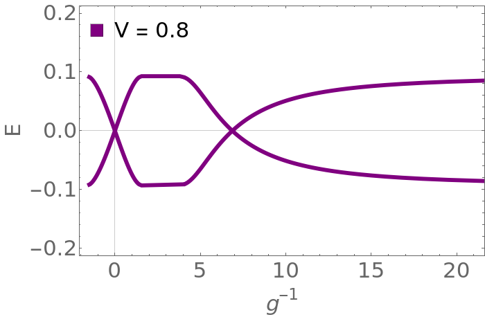

# Calculate Shiba bound states in Majorana nano wires
Solve greens functions associated with bound state impurities as seen in [Sau,Demler](http://cmt.harvard.edu/demler/PUBLICATIONS/ref170.pdf)

## Instructions
* Run python code to generate data and mathematica to plot.

## To Do
* Create a wrap around bash script to run everything.
* Add a Show[] command to mathematica to allow multiple values of V to be shown on same plot.

